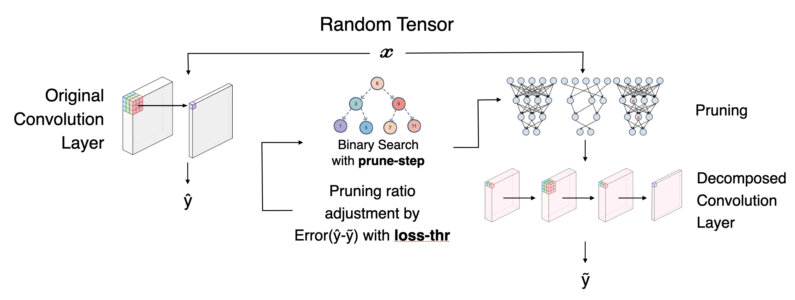

# AYOLOv2
<!-- ALL-CONTRIBUTORS-BADGE:START - Do not remove or modify this section -->
[](#contributors-)
<!-- ALL-CONTRIBUTORS-BADGE:END -->
The main goal of this repository is to rewrite the object detection pipeline with a better code structure for better portability and adaptability to apply new experimental methods.
The object detection pipeline is based on [Ultralytics YOLOv5](https://github.com/ultralytics/yolov5).

## What's inside of this repository
1. YOLOv5 based portable model (model built with [kindle](https://github.com/JeiKeiLim/kindle))
2. Model conversion (TorchScript, ONNX, TensorRT) support
3. Tensor decomposition model with pruning optimization
4. Stochastic Weight Averaging(SWA) support
5. Auto search for NMS parameter optimization
6. W&B support with model save and load functionality
7. Representative Learning (Experimental)
8. Distillation via soft teacher method (Experimental)
9. C++ inference (WIP)
10. AutoML - searching efficient architecture for the given dataset(incoming!)

# Table of Contents

* [How to start](#how-to-start)
  * [Install](#how-to-start)
    * [Using conda environment](#using-conda-environment)
    * [Using docker](#using-docker)
  * [Train a model](#using-docker)
    * [Prepare dataset](#using-docker)
    * [Training config](#using-docker)
    * [Model config](#using-docker)
    * [Multi-GPU training](#using-docker)
  * [Run a model validation](#using-docker)
    * [Validate from local weights](#using-docker)
    * [Validate from W&B path](#using-docker)
    * [Validate with TTA](#using-docker)
* [Pretrained models](#pretrained-models)
* [Advanced usages](#advanced-usages)
  * [Export model to TorchScript, ONNX, TensorRT](#advanced-usages)
  * [Applying tensor decomposition](#advanced-usages)
  * [Knowledge distillation](#advanced-usages)
  * [Representation learning](#advanced-usages)
  * [Auto search for NMS parameters](#advanced-usages)
  * [Applying SWA(Stochastic Weight Averaging)](#advanced-usages)
* [References](#references)
  * [Object Detection](#object-detection)
  * [Stochastic Weight Averaging](#stochastic-weight-averaging)
  * [Knowledge Distillation](#knowledge-distillation)
  * [Tensor Decomposition and Pruning](#tensor-decomposition-and-pruning)
  * [Non Maximum Supression](#non-maximum-suppression)
* [Contributors ✨](#contributors-✨)

# How to start
<details open>
  <summary>Install</summary>

  - [Conda virtual environment](https://docs.conda.io/en/latest/miniconda.html) or [docker](https://www.docker.com) is required to setup the environment

  ### Using conda environment
  ```bash
  git clone https://github.com/j-marple-dev/AYolov2.git
  cd AYolov2
  ./run_check.sh init
  # Equivalent to
  # conda env create -f environment.yml
  # pre-commit install --hook-type pre-commit --hook-type pre-push
  ```

  ### Using docker
  #### Building a docker image
  ```bash
  ./run_docker.sh build
  # You can add build options
  # ./run_docker.sh build --no-cache
  ```

  #### Running the container
  This will mount current repository directory from local disk to docker image
  ```bash
  ./run_docker.sh run
  # You can add running options
  # ./run_docker.sh run -v $DATASET_PATH:/home/user/dataset
  ```

  #### Executing the last running container
  ```bash
  ./run_docker.sh exec
  ```
</details>
<details open>
  <summary>Train a model</summary>

- Example

  ```python
  python3 train.py --model $MODEL_CONFIG_PATH --data $DATA_CONFIG_PATH --cfg $TRAIN_CONFIG_PATH
  # i.e.
  # python3 train.py --model res/configs/model/yolov5s.yaml --data res/configs/data/coco.yaml --cfg res/configs/cfg/train_config.yaml
  # Logging and upload trained weights to W&B
  # python3 train.py --model res/configs/model/yolov5s.yaml --wlog --wlog_name yolov5s
  ```

  <details>
    <summary>Prepare dataset</summary>

    - Dataset config file

    ```yaml
    train_path: "DATASET_ROOT/images/train"
    val_path: "DATASET_ROOT/images/val"

    # Classes
    nc: 10  # number of classes
    dataset: "DATASET_NAME"
    names: ['person', 'bicycle', 'car', 'motorcycle', 'airplane', 'bus', 'train', 'truck', 'boat', 'traffic light']  # class names
    ```

    - Dataset directory structure
      - One of `labels` or `segments` directory must exist.
      - Training label type(`labels` or `segments`) will be specified in the training config.
      - images and labels or segments must have a matching filename with .txt extension.

    ```bash
    DATASET_ROOT
    │
    ├── images
    │   ├── train
    │   └── val
    ├── labels
    │   ├── train
    │   └── val
    ├── segments
    │   ├── train
    │   └── val
    ```

  </details>

  <details>
    <summary>Training config</summary>

    - Default training configurations are defined in [train_config.yaml](res/configs/cfg/train_config.yaml).
    - You may want to change `batch_size`, `epochs`, `device`, `workers`, `label_type` along with your model, dataset, and training hardware.
    - Be cautious to change other parameters. It may affect training results.

  </details>

  <details>
    <summary>Model config</summary>

    - Model is defined by yaml file with [kindle](https://github.com/JeiKeiLim/kindle)
    - Please refer to https://github.com/JeiKeiLim/kindle

  </details>

  <details>
    <summary>Multi-GPU training</summary>

    - Please use torch.distributed.run module for multi-GPU Training

    ```bash
    python3 -m torch.distributed.run --nproc_per_node $N_GPU train.py --model $MODEL_CONFIG_PATH --data $DATA_CONFIG_PATH --cfg $TRAIN_CONFIG_PATH
    ```
      - N_GPU: Number of GPU to use

  </details>

</details>


<details open>
  <summary>Run a model validation</summary>

  - Validate from local weights
  ```bash
  python3 val.py --weights $WEIGHT_PATH --data-cfg $DATA_CONFIG_PATH
  ```

  - You can pass W&B path to the `weights` argument.
  ```bash
  python3 val.py --weights j-marple/AYolov2/179awdd1 --data-cfg $DATA_CONFIG_PATH
  ```

  - **TTA** (Test Time Augmentation)
    - Simply pass `--tta` argument with `--tta-cfg` path
    - Default TTA configs are located in [`res/configs/cfg/tta.yaml`](res/configs/cfg/tta.yaml)

  ```bash
  python3 val.py --weights $WEIGHT_PATH --data-cfg $DATA_CONFIG_PATH --tta --tta-cfg $TTA_CFG_PATH
  ```


</details>


## Pretrained models
| Name  | W&B URL | img_size |    mAP<sup>val<br>0.5:0.95</sup>    |         mAP<sup>val<br>0.5</sup>         |    params|
|-------|---------------------------------------------------------------------------------------|---|----|----|----------|
|YOLOv5s|<sub>[j-marple/AYolov2/179awd1](https://wandb.ai/j-marple/AYolov2/runs/179awdd1)</sub>|640|37.7|57.2| 7,235,389|
|YOLOv5m(WIP)|<sub>[j-marple/AYolov2/sybi3bnq](https://wandb.ai/j-marple/AYolov2/runs/sybi3bnq)</sub>|640|48.4|65.4|21,190,557|
|YOLOv5l(WIP)|<sub>[j-marple/AYolov2/1beuv3fd](https://wandb.ai/j-marple/AYolov2/runs/1beuv3fd)</sub>|640|51.3|67.8|46,563,709|
|YOLOv5x(WIP)|<sub>[j-marple/AYolov2/1gxaqgk4](https://wandb.ai/j-marple/AYolov2/runs/1gxaqgk4)</sub>|640|52.9|69.2|86,749,405|

</details>

# Advanced usages
<details>
  <summary>Export model to TorchScript, ONNX, TensorRT</summary>

  - You can export a trained model to TorchScript, ONNX, or TensorRT
  - INT8 is currently not supported.

  - Usage
  ```bash
  python3 export.py --weights $WEIGHT_PATH --type [torchscript, ts, onnx, tensorrt, trt] --dtype [fp32, fp16, int8]
  ```

  - Above command will generate both model and model config file.
    - Example) FP16, Batch size 8, Image size 640x640, TensorRT
      - model_fp16_8_640_640.trt
      - model_fp16_8_640_640_trt.yaml
      ```yaml
      batch_size: 8
      conf_t: 0.001  # NMS confidence threshold
      dst: exp/  # Model location
      dtype: fp16  # Data type
      gpu_mem: 6  # GPU memory restriction
      img_height: 640
      img_width: 640
      iou_t: 0.65  # NMS IoU threshold
      keep_top_k: 100  # NMS top k parameter
      model_cfg: res/configs/model/yolov5x.yaml  # Base model config location
      opset: 11  # ONNX opset version
      rect: false  # Rectangular inference mode
      stride_size: 32  # Model stride size
      top_k: 512  # Pre-NMS top k parameter
      type: trt  # Model type
      verbose: 1  # Verbosity level
      weights: ./exp/yolov5x.pt  # Base model weight file location
      ```

  - Once, model has been exported, you can run val.py with the exported model.
    - `ONNX` inference is currently not supported.

    ```bash
    python3 val.py --weights model_fp16_8_640_640.trt --data-cfg $DATA_CONFIG_PATH
    ```

</details>

<details open>
  <summary>Applying tensor decomposition</summary>

  - A trained model can be compressed via tensor decomposition.
  - Decomposed conv is composed of 3 convolutions from 1 large convolution.
    - Example)
      - Original conv: 64x128x3x3
      - Decomposed conv: 64x32x1x1 -> 32x16x3x3 -> 16x128x1x1

  - Usage
  ```bash
  python3 decompose_model.py --weights $WEIGHT_PATH --loss-thr $DECOMPOSE_LOSS_THRESHOLD --prune-step $PRUNING_STEP --data-cfg $DATA_CONFIG_PATH
  ```
  - Passing `prune-step` to 0 will skip pruning optimization.

  #### Summary of tensor decomposition process

    <p align="center">
      
    </p>

    1. Pass random tensor **x** to original conv (**ŷ**) and decomposed conv (**ỹ**)
    2. Compute **E** = Error(ŷ, ỹ)
    3. If **E** < **loss-thr**, use decomposed conv
    4. Apply pruning ratio with binary search
    5. Jump to 1 until differential of pruning ratio is less than **prune-step**

    **\*\* Note** - Decomposition process uses CPU only.

</details>

<details open>
  <summary>Knowledge distillation</summary>

</details>

<details open>
  <summary>Representation learning</summary>

</details>

<details open>
  <summary>Auto search for NMS parameters</summary>

</details>

<details>
  <summary> Applying SWA(Stochastic Weight Averaging)</summary>

  There are three steps to apply SWA (Stochastic Weight Averaging):

  1. Fine-tune pre-trained model
  2. Create SWA model
  3. Test SWA model

  ## 1. Fine-tune pre-trained model
  ### Example
  ```bash
  $ python train.py --model yolov5l_kindle.pt \
                    --data res/configs/data/coco.yaml \
                    --cfg res/configs/cfg/finetune.yaml \
                    --wlog --wlog_name yolov5l_swa \
                    --use_swa
  ```

  ## 2. Create SWA model
  ### Example
  ```bash
  $ python create_swa_model.py --model_dir exp/train/2021_1104_runs/weights \
                               --swa_model_name swa_best5.pt \
                               --best_num 5
  ```
  ### Usage
  ```bash
  $ python create_swa_model.py --help
  usage: create_swa_model.py [-h] --model_dir MODEL_DIR
                             [--swa_model_name SWA_MODEL_NAME]
                             [--best_num BEST_NUM]

  optional arguments:
    -h, --help            show this help message and exit
    --model_dir MODEL_DIR
                          directory of trained models to apply SWA (default: )
    --swa_model_name SWA_MODEL_NAME
                          file name of SWA model (default: swa.pt)
    --best_num BEST_NUM   the number of trained models to apply SWA (default: 5)
  ```

  ## 3. Test SWA model
  ### Example
  ```bash
  $ python val.py --weights exp/train/2021_1104_runs/weights/swa_best5.pt \
                  --model-cfg '' \
                  --data-cfg res/configs/data/coco.yaml \
                  --conf-t 0.1 --iou-t 0.2
  ```
</details>

# References
## Object Detection
[1] Ultralytics YOLOv5 - https://github.com/ultralytics/yolov5

[2] YOLOR implementation - https://github.com/WongKinYiu/yolor.git

[3] MobileViT implementation - https://github.com/chinhsuanwu/mobilevit-pytorch

[4] Kindle - Making a PyTorch model easier than ever! - https://github.com/JeiKeiLim/kindle

[5] Wang, Chien-Yao, I-Hau Yeh, and Hong-Yuan Mark Liao. "You Only Learn One Representation: Unified Network for Multiple Tasks." arXiv preprint arXiv:2105.04206 (2021).

[6] Mehta, Sachin, and Mohammad Rastegari. "MobileViT: Light-weight, General-purpose, and Mobile-friendly Vision Transformer." arXiv preprint arXiv:2110.02178 (2021).

[7] Ghiasi, Golnaz, et al. "Simple copy-paste is a strong data augmentation method for instance segmentation." Proceedings of the IEEE/CVF Conference on Computer Vision and Pattern Recognition. 2021.

## Stochastic Weight Averaging

[8] SWA Object Detection implementation - https://github.com/hyz-xmaster/swa_object_detection

[9] Izmailov, Pavel, et al. "Averaging weights leads to wider optima and better generalization." arXiv preprint arXiv:1803.05407 (2018).

[10] Zhang, Haoyang, et al. "Swa object detection." arXiv preprint arXiv:2012.12645 (2020).

## Knowledge Distillation

[11] Xu, Mengde, et al. "End-to-End Semi-Supervised Object Detection with Soft Teacher." arXiv preprint arXiv:2106.09018 (2021).

[12] He, Kaiming, et al. "Momentum contrast for unsupervised visual representation learning." Proceedings of the IEEE/CVF Conference on Computer Vision and Pattern Recognition. 2020.

[13] Chen, Ting, et al. "A simple framework for contrastive learning of visual representations." International conference on machine learning. PMLR, 2020.

[14] Grill, Jean-Bastien, et al. "Bootstrap your own latent: A new approach to self-supervised learning." arXiv preprint arXiv:2006.07733 (2020).

[15] Roh, Byungseok, et al. "Spatially consistent representation learning." Proceedings of the IEEE/CVF Conference on Computer Vision and Pattern Recognition. 2021.

## Tensor Decomposition and Pruning

[16] PyTorch tensor decompositions - https://github.com/jacobgil/pytorch-tensor-decompositions

[17] PyTorch pruning tutorial - https://pytorch.org/tutorials/intermediate/pruning_tutorial.html

## Non Maximum Suppression

[18] Batched NMS - https://github.com/ultralytics/yolov3/blob/f915bf175c02911a1f40fbd2de8494963d4e7914/utils/utils.py#L562-L563

[19] Fast NMS - https://github.com/ultralytics/yolov3/blob/77e6bdd3c1ea410b25c407fef1df1dab98f9c27b/utils/utils.py#L557-L559

[20] Matrix NMS - https://github.com/ultralytics/yolov3/issues/679#issuecomment-594132977

[21] Merge NMS - https://github.com/ultralytics/yolov5/blob/master/utils/general.py#L710-L722

[22] Cluster NMS - https://github.com/Zzh-tju/yolov5/blob/master/utils/general.py#L689-L774


<br />


## Contributors ✨

Thanks goes to these wonderful people ([emoji key](https://allcontributors.org/docs/en/emoji-key)):

<!-- ALL-CONTRIBUTORS-LIST:START - Do not remove or modify this section -->
<!-- prettier-ignore-start -->
<!-- markdownlint-disable -->
<table>
  <tr>
    <td align="center"><a href="https://limjk.ai"><br /><sub><b>Jongkuk Lim</b></sub></a><br /><a href="https://github.com/j-marple-dev/AYolov2/commits?author=JeiKeiLim" title="Code">💻</a></td>
    <td align="center"><a href="https://github.com/ulken94"><br /><sub><b>Haneol Kim</b></sub></a><br /><a href="https://github.com/j-marple-dev/AYolov2/commits?author=ulken94" title="Code">💻</a></td>
    <td align="center"><a href="https://github.com/HSShin0"><br /><sub><b>Hyungseok Shin</b></sub></a><br /><a href="https://github.com/j-marple-dev/AYolov2/commits?author=HSShin0" title="Code">💻</a></td>
    <td align="center"><a href="https://wooks.page/docs"><br /><sub><b>Hyunwook Kim</b></sub></a><br /><a href="https://github.com/j-marple-dev/AYolov2/commits?author=wooks527" title="Code">💻</a></td>
  </tr>
</table>

<!-- markdownlint-restore -->
<!-- prettier-ignore-end -->

<!-- ALL-CONTRIBUTORS-LIST:END -->

This project follows the [all-contributors](https://github.com/all-contributors/all-contributors) specification. Contributions of any kind are welcome!
